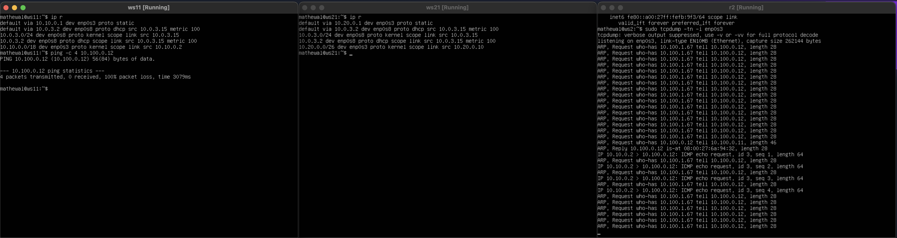

#### Let's install all needed tools: ipcalc, ip, netplan, netstat, iperf3, iptables, ping, nmap, sysctl, tcpdump, traceroute, systemctl, telnet, dhclient with sudo apt install <tool's name> 

## Part 1. Инструмент **ipcalc**

#### 1.1. Сети и маски
##### Определи и запиши в отчёт:
##### 1) Адрес сети *192.167.38.54/13*

##### 2) Перевод маски *255.255.255.0* в префиксную и двоичную запись

##### 3) */15* в обычную и двоичную

##### 4) *11111111.11111111.11111111.11110000* в обычную и префиксную

##### 5) Минимальный и максимальный хост в сети *12.167.38.4* при масках: */8* 

##### 6) *11111111.11111111.00000000.00000000*

##### 7) *255.255.254.0*

##### 8) */4*

#### 1.2. localhost
##### Можно ли обратиться к приложению, работающему на localhost, со следующими IP:
##### 1) *194.34.23.100* -> Нет

##### 2) *127.0.0.2* -> Да

##### 3) *127.1.0.1* -> Да

##### 4) *128.0.0.1* -> Нет

#### 1.3. Диапазоны и сегменты сетей
##### 1)
##### Для IPv4 частные IP-адреса используются следующие диапазоны:
##### 10.0.0.0 до 10.255.255.255 (маска подсети 255.0.0.0 или /8)
##### 172.16.0.0 до 172.31.255.255 (маска подсети 255.240.0.0 или /12)
##### 192.168.0.0 до 192.168.255.255 (маска подсети 255.255.0.0 или /16)
##### Эти диапазоны определены IANA как адреса, выделенные локальным сетям.
##### Соответственно все остальные будут публичными: 

##### 2)
##### Первый адрес сети: 10.10.0.1
##### Последний адрес сети: 10.10.63.254
##### Все адреса между ними

##### 1) Какие из перечисленных IP можно использовать в качестве публичного, а какие только в качестве частных: 
##### *10.0.0.45* -> частный, 
##### *134.43.0.2* -> Публичный,
##### *192.168.4.2* -> частный,
##### *172.20.250.4* -> частный,
##### *172.0.2.1* -> Публичный,
##### *192.172.0.1* -> Публичный, 
##### *172.68.0.2* -> Публичный, 
##### *172.16.255.255* -> частный, 
##### *10.10.10.10* -> частный, 
##### *192.169.168.1*  -> Публичный

##### 2) Какие из перечисленных IP адресов шлюза возможны у сети *10.10.0.0/18*: 
##### *10.0.0.1* -> не подходит, 
##### *10.10.0.2* -> подходит, 
##### *10.10.10.10* -> подходит, 
##### *10.10.100.1* -> не подходит, 
##### *10.10.1.255* -> подходит

## Part 2. Статическая маршрутизация между двумя машинами
- скрин с вызовом `ip a` и выводом использованной команды

- содержание изменённого файла *etc/netplan/00-installer-config.yaml* для каждой машины.

- скрин с вызовом и выводом `netplan apply` использованной команды.

#### 2.1. Добавление статического маршрута вручную
- скрин с вызовом и выводом `ip r add` и `ping`.

#### 2.2. Добавление статического маршрута с сохранением
##### Перезапусткаем машины с использованием `reboot`.
- скрин с содержанием изменённого файла */etc/netplan/00-installer-config.yaml*.

##### Пропингуем соединение между машинами.
- В отчёт помещаем скрин с вызовом и выводом команды `ping -c 5`.

## Part 3. Утилита **iperf3**

#### 3.1. Скорость соединения
* 8 Mbps = 1 MB/s
* 100 MB/s = 800000 Kbps
* 1 Gbps = 1000 Mbps

#### 3.2. Утилита **iperf3**

- В отчёт помести скрины с вызовом и выводом использованных команд.

## Part 4. Сетевой экран

#### 4.1. Утилита **iptables**

##### Создаем файл `/etc/firewall.sh`, имитирующий фаерволл на `ws1` и `ws2`.

- Разница между стратегиями, применёнными в первом и втором файлах, заключается в порядке правил для разрешения и запрета echo reply.  
- На ws1 сначала идёт правило, запрещающее echo reply, а затем правило, разрешающее echo reply. Таким образом, на ws1 машина не должна «пинговаться».  
- На ws2 сначала идёт правило, разрешающее echo reply, а затем правило, запрещающее echo reply. Таким образом, на ws2 машина должна «пинговаться».

#### 4.2. Утилита **nmap**
- `ping`

- `nmap`

## Part 5. Статическая маршрутизация сети

схема сети

- Согласно схеме нужно поднять 5 виртульных машиин, для этого в VM Virtual Box Manager делаем следующее:
- Для `r1`: Settings > Network > Adapter 1 (Internal Network, r1-ws11), Adapter 2 (Internal Network, r1-r2), Adapter 3 (NAT)
- Для `r2`: Settings > Network > Adapter 1 (Internal Network, r1-r2), Adapter 2 (Internal Network, r2-ws21-ws22), Adapter 3 (NAT)
- Для `ws11`: Settings > Network > Adapter 1 (Internal Network, r1-ws11), Adapter 2 (NAT)
- Для `ws21, ws22`: Settings > Network > Adapter 1 (Internal Network, r2-ws21-ws22), Adapter 2 (NAT)

#### 5.1. Настройка адресов машин
- файлы конфигураций:

- вывод `ip -4 a`

- пропингуем ws22 с ws21, r1 с ws11

#### 5.2. Включение переадресации IP-адресов
- выполняем команду на роутерах:`sysctl -w net.ipv4.ip_forward=1`

*При таком подходе переадресация не будет работать после перезагрузки системы.*

- Откроем файл */etc/sysctl.conf* и добавь в него `net.ipv4.ip_forward = 1`

*При использовании этого подхода, IP-переадресация включена на постоянной основе.*

#### 5.3. Установка маршрута по-умолчанию

- Настроем маршрут по-умолчанию (шлюз) для рабочих станций. Для этого добавим `default` перед IP роутера в файле конфигураций:

- Вызоваем `ip r` и покажем, что добавился маршрут в таблицу маршрутизации

- Пропингуем с ws11 роутер r2 и покажи на r2, что пинг доходит. Для этого используем команду `tcpdump -tn -i eth0`

#### 5.4. Добавление статических маршрутов
- Добавим в роутеры r1 и r2 статические маршруты в файле конфигураций.

- Вызовем `ip r` и покажи таблицы с маршрутами на обоих роутерах.

- Запустим на ws11 команды `ip r list 10.10.0.0/[маска сети]` и `ip r list 0.0.0.0/0`

Для адреса 10.10.0.0/18 был выбран маршрут, отличный от 0.0.0.0/0, потому что при наличии нескольких маршрутов одинаковой длины выбирается тот маршрут, который задан наиболее точно.

#### 5.5. Построение списка маршрутизаторов

- Запусти на r1 команду дампа `tcpdump -tnv -i eth0`

- Принцип работы `traceroute`:  
Для определения промежуточных маршрутизаторов traceroute отправляет серию пакетов данных целевому узлу, при этом каждый раз увеличивая на 1 значение поля TTL («время жизни»). Это поле обычно указывает максимальное количество маршрутизаторов, которое может быть пройдено пакетом. Первый пакет отправляется с TTL, равным 1, и поэтому первый же маршрутизатор возвращает обратно сообщение ICMP, указывающее на невозможность доставки данных. Traceroute фиксирует адрес маршрутизатора, а также время между отправкой пакета и получением ответа (эти сведения выводятся на монитор компьютера). Затем traceroute повторяет отправку пакета, но уже с TTL, равным 2, что позволяет первому маршрутизатору пропустить пакет дальше.  
Процесс повторяется до тех пор, пока при определённом значении TTL пакет не достигнет целевого узла. При получении ответа от этого узла процесс трассировки считается завершённым.

#### 5.6. Использование протокола **ICMP** при маршрутизации
- Запустим на r1 перехват сетевого трафика, проходящего через eth0 с помощью команды `tcpdump -n -i eth0 icmp` и Пропингуем с ws11 несуществующий IP (например, *10.30.0.111*) с помощью команды `ping -c 1 10.30.0.111`

## Part 6. Динамическая настройка IP с помощью **DHCP**

##### Для r2 настроим в файле */etc/dhcp/dhcpd.conf* конфигурацию службы **DHCP**Ж
- 1) Укажем адрес маршрутизатора по-умолчанию, DNS-сервер и адрес внутренней сети.

- 2) В файле *resolv.conf* пропиши `nameserver 8.8.8.8`.

- Перезагрузим службу **DHCP** командой `systemctl restart isc-dhcp-server`.

- Машину ws21 перезагрузим при помощи `reboot` и через `ip a` покажем, что она получила адрес.

- Также пропингуем ws22 с ws21.

- В отчёт помести скрины с вызовом и выводом использованных команд.

- Укажем MAC адрес у ws11, для этого в *etc/netplan/00-installer-config.yaml* надо добавить строки: `macaddress: 10:10:10:10:10:BA`, `dhcp4: true`.

- Для r1 настроем аналогично r2, но сделаем выдачу адресов с жесткой привязкой к MAC-адресу (ws11).

- Запросим с ws21 обновление ip адреса.
- До:

- После:

## Part 7. **NAT**

- В файле */etc/apache2/ports.conf* на ws22 и r1 изменем строку `Listen 80` на `Listen 0.0.0.0:80`, то есть сделаем сервер Apache2 общедоступным.

- Запустим веб-сервер Apache командой `service apache2 start` на ws22 и r1.

- Добавим в фаервол, созданный по аналогии с фаерволом из Части 4, на r2 следующие правила:

*При запуске файла с этими правилами, ws22 не должна «пинговаться» с r1.*

- Добавим в файл ещё одно правило: разрешим маршрутизацию всех пакетов протокола **ICMP**.

- Проверим соединение между ws22 и r1 командой `ping`.

*При запуске файла с этими правилами, ws22 должна «пинговаться» с r1.*

- Добавим в файл ещё два правила, включим **SNAT**, а именно маскирование всех локальных ip из локальной сети, находящейся за r2 (по обозначениям из Части 5 - сеть 10.20.0.0), включим **DNAT** на 8080 порт машины r2 и добавить к веб-серверу Apache, запущенному на ws22, доступ извне сети.

- запустим файл также, как в Части 4, проверим соединение по TCP для **SNAT**: для этого с ws22 подключиться к серверу Apache на r1 командой `telnet [адрес] [порт]`

