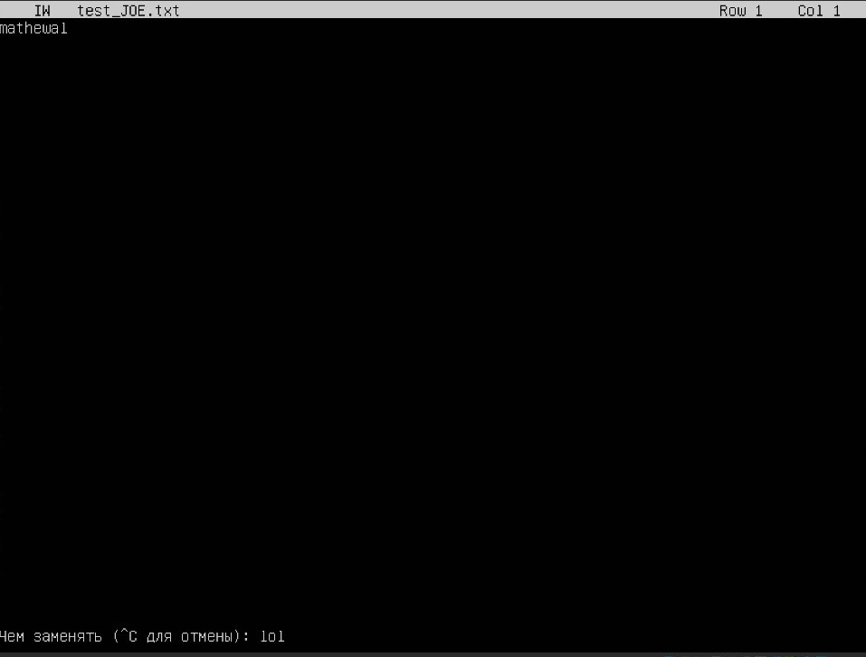
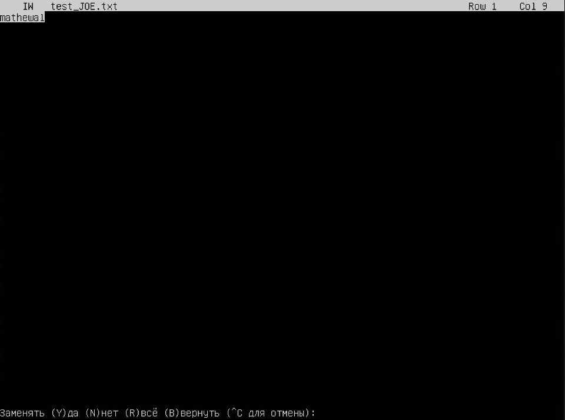
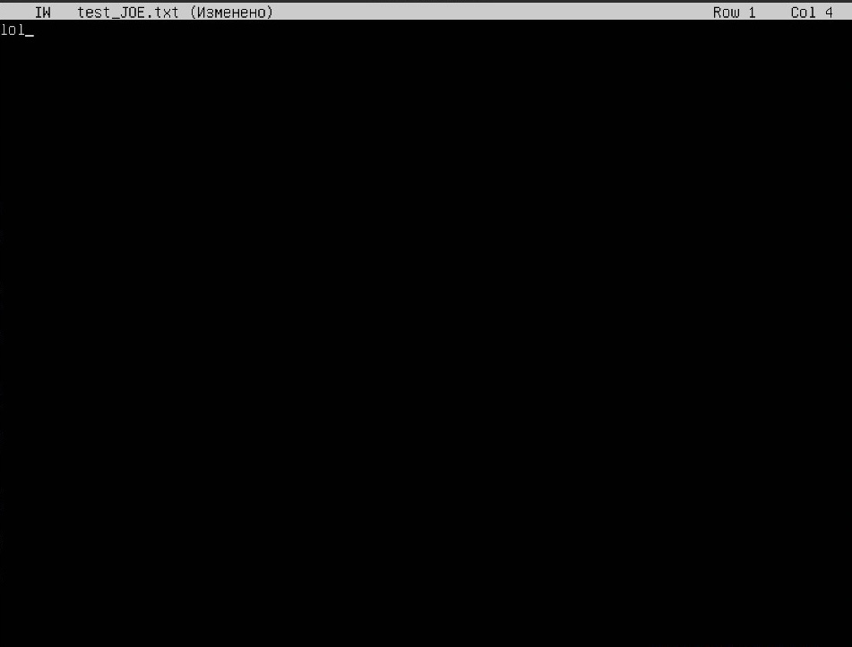

# Операционные системы UNIX/Linux (Базовый).  

## Part 1. Установка ОС

- вводим `cat /etc/issue.`
- 

## Part 2. Создание пользователя

- 

- вводим `cat /etc/passwd`
- 

## Part 3. Настройка сети ОС

- 

- 

- 
  - lo (loopback device) – виртуальный интерфейс, присутствующий по умолчанию в любом Linux. Он используется для отладки сетевых программ и запуска серверных приложений на локальной машине.

-  
  - DHCP (Dynamic Host Configuration Protocol) - это протокол динамической настройки узла, позволяющий устройствам автоматически получать IP-адрес, данные о DNS-сервере и другие параметры, необходимые для работы в сети.

- 

- ")

- 

- 

- 

- 

- 

  - перезагружаем машину, узнаем ip
- 

- пингуем хост 1.1.1.1
- 

- пингуем ya.ru
- 

## Part 4. Обновление ОС

- обновляем системные пакеты
- повторно вводим команды для обновления пакетов
- 

## Part 5. Использование команды **sudo**

- добавляем пользователя в группу sudo командой `sudo usermod -aG sudo [имя пользователя]`
  sudo - основной способ повышать привилегии в современных системах — утилита sudo (substitute user and do — дословно «подменить пользователя и выполнить») позволяет выполнить какую-либо команду от лица супер-пользователя, на которого не действуют никакие ограничения, у которого есть права на всё

- меняем название машины от лица этого пользователя 
- 

## Part 6. Установка и настройка службы времени

- 

## Part 7. Установка и использование текстовых редакторов 

### создать, отредачить, выйти, сохранив

- #### nano 
- 
  для закрытием с сохранением используем `Ctrl+O` для сохранения и `Ctrl+X` для выхода

- #### vim
- 
  для редактирования `i` для выхода с сохранением `esc, :wq, enter`

- #### joe
- 
  - редактируем, нажимаем `Ctrl+K, Q`, если были изменения, joe спросит сохранить ли их - соглашаемся. Чтобы явно cохранить - изменения используем `Ctrl+X`

### отредачить, выйти, не сохранив

- #### nano
- 
  - чтобы выйти без сохранения `Ctrl+X, N`

- #### vim
- 
  - включаем режим редактирования `i`,  выходим без сохранения с помощью `esc, :q!`

- #### joe
- 
  - для выхода без сохранения изменений `Сtrl+C`

### поиск, замена

- ##### поиск

- #### nano
- 
  - для поиска используем сочетание клавиш `Ctrl+W, enter`

- #### vim
- 
  - для поиска в vim исползуем `/` и вводим что искать, vim подсвечивает совпадения

- #### joe
- 
  - для поиска используем `Ctrl+K, F, enter`,

- #### замена

- #### nano
- 
  - для замены в nano используем `Ctrl+/`, вводим текст, который нужно заменить, `enter`, вводим на что меняем, `enter`, жмем `A` -> заменяем все вхождения / `Y` заменяем текущее и переходим к следующему

- #### vim
- 
  - вводим `:%s/что меняем/на что меняем`, `enter`

- #### joe
- 
- 
- 
- 
  - для замены в joe используем `Ctrl+K, F`, пишем что ищем, `enter`, `r`, пишем на что меняем, `enter`, `y`

## Part 8. Установка и базовая настройка сервиса **SSHD**

- ##### Установка службы ssh
  прописываем три команды, представленные ниже (повторный их вызов сообщит, что нет пакетов, с которыми можно было хоть что-то сделать)
- 

- #### Добавление автостарта
  Добавление автозапуска не потребовалось, он стоял по умолчанию, проверка:
- 

- #### Изменение порта на 2022
  Прописываем следующую команду:
- 
  изменяем в строчку `Port` так, чтобы получилось как на скрине
- 

- #### ps
- 
  - Команда ps выводит информацию о процессах системы, ключ `-A` - вывод всех процессов, в т.ч. фоновых, grep в данном случае фильтрует вывод ps, пропуская тольло информацию о интересующем нас `sshd`

- #### перезагрузка системы
  выключаем машину, затем включаем её снова
- 

- Значение ключей -tan
    - -a - Отображение всех подключений и ожидающих портов.
    - -t - Отображение текущего подключения в состоянии переноса нагрузки с процессора на сетевой адаптер при передаче данных ( "offload" ).
    - -n - Отображение адресов и номеров портов в числовом формате.

- значение каждого столбца вывода
    - Proto — протокол (tcp, udp).
    - Recv-Q — количество байтов, помещённых в буфер приёма TCP/IP, но не переданных приложению. Если это число высокое, то нужно проверить работоспособность приложения, которое работает с данным портом.
    - Send-Q — количество байтов, помещённых в буфер отправки TCP/IP, но не отправленных, или отправленных, но не подтверждённых. Высокое значение может быть связано с перегрузкой сети сервера.
    - Local Address — локальный адрес сервера. В обычных соединения, это адрес сервера на который пришло соединение. В прослушиваемых портах (LISTEN) — это диапазон адресов. Так 0.0.0.0:port — значит подключаться можно ко всем адресам сервера, а 192.168.0.35:port — значит подключаться можно только к этому адресу сервера.
    - Foreign Address — адрес второй стороны. В обычных соединения, это адрес с которого пришло соединение. В прослушиваемых портах (LISTEN) — это диапазон адресов. Так 0.0.0.0:* — значит подключаться можно с любых адресов и с любых портов, а например 192.168.0.50:* — значит подключаться можно только с этого адреса и с любых портов.
    - State — состояние подключения, или прослушивания.

- значение 0.0.0.0 
    - IP-адрес 0.0.0.0 означает «эта сеть», но для использования в традиционном смысле этот адрес непригоден. Это похоже на ссылку: «Вставьте сюда адрес», или, в зависимости от контекста, «без конкретного адреса назначения». Он действует как резервный, пока не будет назначен действительный маршрутизируемый IP-адрес. 
    - В качестве статического маршрута по умолчанию. Это означает, что в таблице маршрутизации не указан конкретный адрес в качестве следующего перехода на пути пакета к его конечному получателю. Когда маршрут по умолчанию используется с маской подсети 0.0.0.0, он соответствует любому адресу. При использовании с маской 255.255.255.255 она не соответствует ни одному маршруту
    - В локальной сети. В локальной сети адрес 0.0.0.0 можно использовать в качестве адреса источника в широковещательной передаче IPv4, которая используется для передачи данных на все устройства в локальной сети.
    - На серверах. IP-адрес 0.0.0.0 может использоваться на серверах для обозначения того, что служба может связываться со всеми сетевыми интерфейсами. Он дает команду серверу «прослушивать» и принимать соединения с любого IP-адреса.
    - На ПК и клиентских устройствах. Адрес 0.0.0.0 указывает, что клиент не подключен к сети TCP / IP, и устройство может дать себе адрес 0.0.0.0, когда оно находится в автономном режиме.

## Part 9. Установка и использование утилит **top**, **htop**

##### Установи и запусти утилиты top и htop. 

- По выводу команды top определим:
  - uptime ` 1 минут 9 секунд `
  - количество авторизованных пользователей ` 1 `
  - общую загрузку системы ` 0.16, 0.05, 0.01, за 1 минуту, 5 минут и 15 минут `
  - общее количество процессов ` 135 процессов `
  - загрузка cpu ` 0 `
  - загрузка памяти ` 183.7MiB `
  - pid процесса занимающего больше всего памяти ` 1425 `
  - pid процесса, занимающего больше всего процессорного времени ` 1425 `

- вывод команды htop:
  - отсортированному по PID, 
  

  - PERCENT_CPU, 
  

  - PERCENT_MEM,
  

  - TIME
  

  - отфильтрованному для процесса sshd
  

  - с процессом syslog, найденным, используя поиск 
  

  - с добавленным выводом hostname, clock и uptime  
  

## Part 10. Использование утилиты **fdisk**

- ##### Запустим команду fdisk -l.

`-`  Название ` VBOX HARDDISK `
`-`  Размер ` 80,74 GiB `
`-`` 169279488 ` секторов

`-`  Размер swap ` ~8 GiB `

## Part 11. Использование утилиты **df** 

##### Запустим команду df.  

- Для корневого раздела (/):
  `-` размер раздела ` 40307976 KiB `
  `-` размер занятого пространства ` 11151452 KiB `
  `-` размер свободного пространства ` 27076780 KiB `
  `-` процент использования ` 30% `
- Используемая единица измерения - ` KiB `

##### Запустим команду df -Th.

- Для корневого раздела (/):
  `-` размер раздела ` 39GiB `
  `-` размер занятого пространства ` 11GiB `
  `-` размер свободного пространства ` 26GiB `
  `-` процент использования ` 30% `
- ext4 (англ. fourth extended file system, ext4fs) — журналируемая файловая система.

## Part 12. Использование утилиты **du**

- ##### Запустим команду du
 

- ##### Размер папок /home, /var, /var/log 

- ##### размер всего содержимого в /var/log 

## Part 13. Установка и использование утилиты **ncdu**

- ##### Выведем размер папок /home, /var, /var/log

`ncdu /home` :

`ncdu /var` :

`ncdu /var/log/*` :

## Part 14. Работа с системными журналами

##### Откроем для просмотра:
- ##### 1. /var/log/dmesg

- ##### 2. /var/log/syslog

- ##### 3. /var/log/auth.log

- время последней успешной авторизации ` 14:30:21 `, имя пользователя ` mathewal `, метод входа в систему ` LOGIN `;

- Перезапустим службу SSHd

## Part 15. Использование планировщика заданий **CRON**

- ##### Используя планировщик заданий, запустим команду uptime через каждые 2 минуты.
- введем команду `sudo crontab -e`
- В открывшемся файле допишем строчку как показано ниже

- выйдем с сохранением

- строчки из логов о выполнении

- список текущих задач 

- ##### Удалим все задания из планировщика заданий также, как добавили

- введем команду `sudo crontab -e` и сотрем все, что не комментарии
- проверим список текущих задач :
